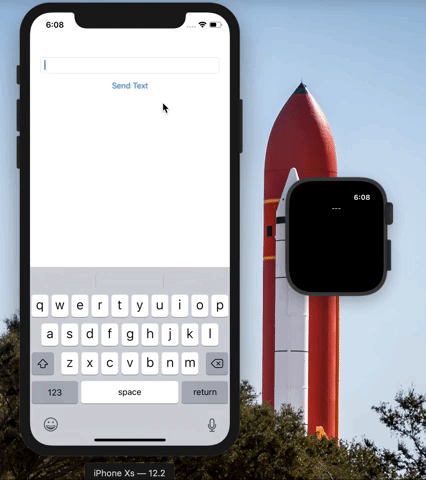

# WatchConnectivityDemo

WatchConnectivity demo app

## Requirements

- Xcode 10
- iOS 12 and watchOS 5

## How to build

- Change the **Team** setting in the **General** tab for each target.
- Build & Run with **Xcode 10**

## How to use

- Launch iOS app and WatchOS app
- Type something into the text field on the phone
- Click **Send Text**
- After clicking **Send Text** the text you typed into the text field should appear on the watch app

## Known Issues

- Not really an issue but both apps must be open for it to work

## Author

**Eric Walker**

Software/hardware hobbyist in Akron Ohio

- GitHub Landing Page:  [My Work](https://ewalk40.github.io/
- Social: [Twitter](https://twitter.com/ewalk40) / [LinkedIn](https://www.linkedin.com/in/eric-walker-003364117)
